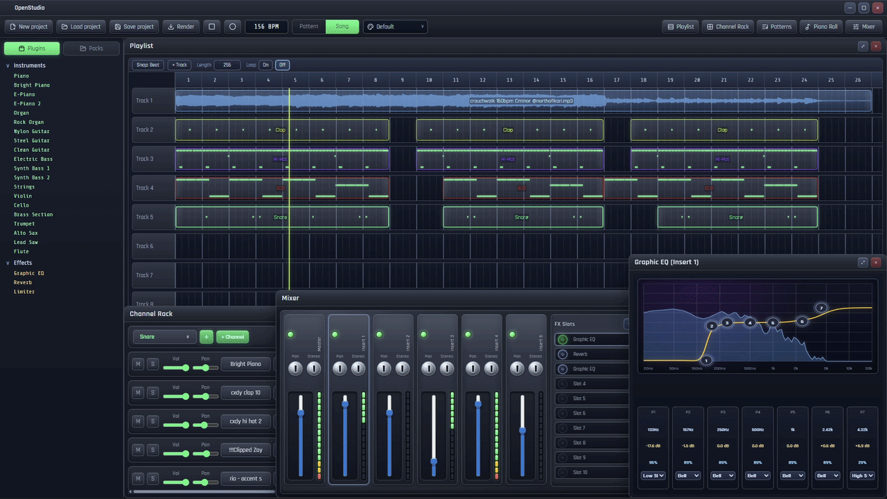
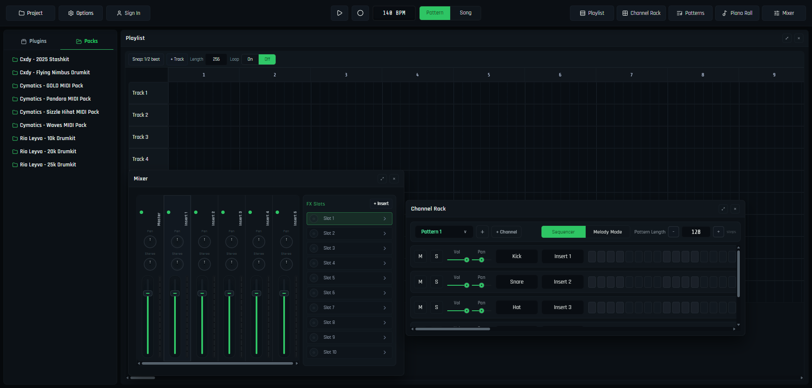
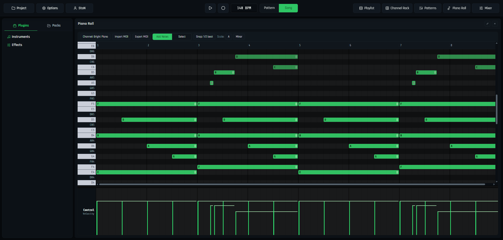
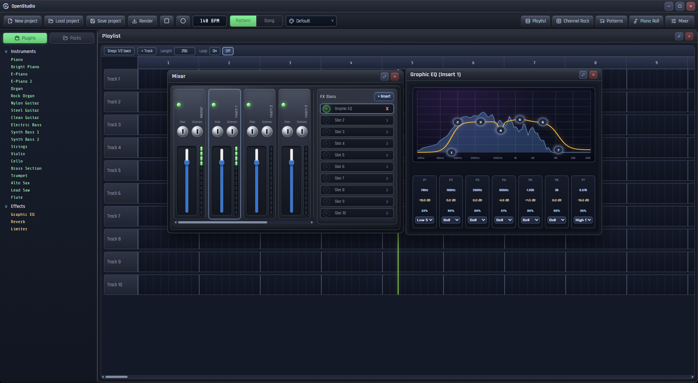
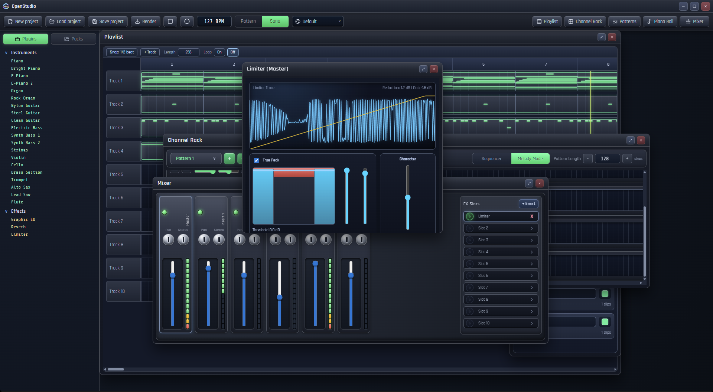
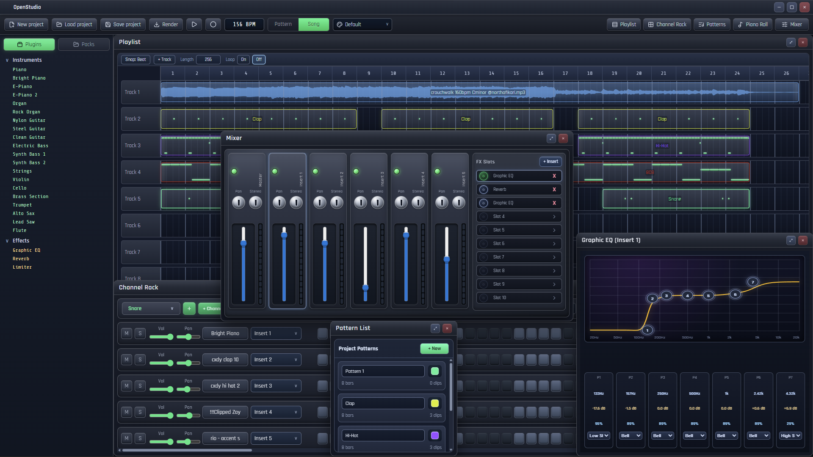
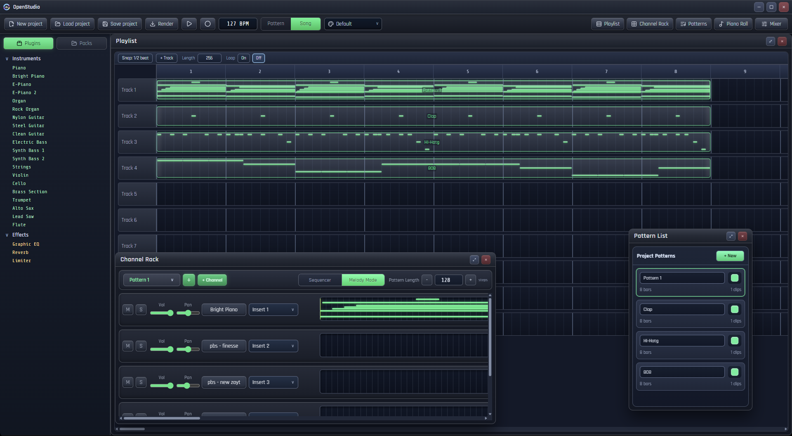

# OpenStudio


OpenStudio is a browser + desktop DAW focused on fast beat creation, arrangement, and final bounce in one workflow.
It combines a Channel Rack, Piano Roll, Playlist, Mixer, built-in FX, and project save/load into a single React + Web Audio + Electron app.



## Table of Contents

- [Links](#links)
- [Why OpenStudio](#why-openstudio)
- [Highlights](#highlights)
- [Built-in Instruments](#built-in-instruments)
- [Screenshots](#screenshots)
- [Sample Projects (Download)](#sample-projects-download)
- [Installation](#installation)
- [Build and Packaging](#build-and-packaging)
- [Scripts](#scripts)
- [Project Structure](#project-structure)
- [Tech Stack](#tech-stack)
- [License](#license)

## Links

- Web App: `https://openstudio-daw.vercel.app`
- Desktop Releases: `https://github.com/808StaN/OpenStudio/releases`

## Why OpenStudio

OpenStudio was built as a practical, accessible beatmaking environment focused on speed, clarity, and a smooth production workflow:

- multi-window DAW interface with large interactive state,
- real-time Web Audio scheduling and transport logic,
- quick idea-to-arrangement workflow with Channel Rack, Piano Roll, Playlist, and Mixer,
- reliable offline export/render pipeline (WAV / MP3),
- one consistent experience across both web and desktop.

## Highlights

- Channel Rack with sequencer + melody mode
- Piano Roll with note editing, velocity lane, MIDI import/export
- Playlist arrangement with patterns and audio clips
- Mixer inserts with FX slots and routing
- Built-in effects: Graphic EQ, Reverb, Limiter/Maximizer
- Sample controls: normalize, envelope, pitch, time-stretch
- Theme system: `Default` and `Midnight`
- Project save/load (`.os`) and export-ready workflow

## Built-in Instruments

OpenStudio includes **20 built-in instrument plugins**. Core examples:

- Piano
- E-Piano
- Organ
- Nylon Guitar
- Strings
- Brass Section
- Flute
- and more.

Instrument definitions are mapped in [`src/data/pluginInstruments.js`](src/data/pluginInstruments.js).

Source of these instruments:
- Loaded via [`soundfont-player`](https://github.com/danigb/soundfont-player)
- Uses General MIDI soundfont instrument names (e.g. `acoustic_grand_piano`, `violin`, `flute`)
- By default, `soundfont-player` uses the **MusyngKite** soundfont set and Benjamin Gleitzman's pre-rendered MIDI.js soundfonts

## Screenshots

### Main workspace



### Piano Roll



### Mixer + FX



### Limiter plugin



### Theme comparison (`Default` vs `Midnight`)




## Sample Projects (Download)

Use these example `.os` files to quickly test loading, instruments, and arrangement behavior:

- [example1.os](docs/projects/example1.os)
- [example2.os](docs/projects/example2.os)
- [example_instrument.os](docs/projects/example_instrument.os)

## Installation

### 1) Clone repository

```bash
git clone https://github.com/808StaN/OpenStudio.git
cd OpenStudio
```

### 2) Install dependencies

```bash
npm install
```

### 3) Run web (development)

```bash
npm run dev
```

### 4) Run desktop (development + hot reload)

```bash
npm run desktop:dev
```

### 5) Run desktop (production mode)

```bash
npm run desktop:start
```

## Build and Packaging

### Build web production bundle

```bash
npm run build
```

### Build Windows unpacked app

```bash
npm run desktop:pack
```

Output:
- `release/win-unpacked/OpenStudio.exe`

### Build Windows installer (NSIS)

```bash
npm run desktop:installer
```

Installer artifacts are generated in `release/`.

## Scripts

- `npm run refresh:packs` - regenerate packs manifest
- `npm run dev` - run web dev server
- `npm run build` - build web production bundle
- `npm run desktop:dev` - run Electron with Vite dev server
- `npm run desktop:pack` - build desktop unpacked app (`release/win-unpacked`)
- `npm run desktop:start` - build unpacked app and run `OpenStudio.exe`
- `npm run desktop:installer` - build Windows installer (NSIS)
- `npm run lint` - run ESLint

## Project Structure

```text
src/
  audio/         realtime scheduler + offline renderer
  components/    windows and DAW UI components
  styles/        app and theme styles
  data/          plugin/instrument metadata
  utils/         helpers (midi, dnd, patterns, sample urls)
electron/        desktop process + preload bridge
scripts/         tooling scripts (packs/installer assets)
public/packs/    packs assets + generated manifest
```

## Tech Stack

- React 19
- Redux Toolkit + React Redux
- Web Audio API
- soundfont-player
- @breezystack/lamejs
- Vite 8
- Electron

## License

Licensed under `GPL-3.0-only`. See [LICENSE](LICENSE).
