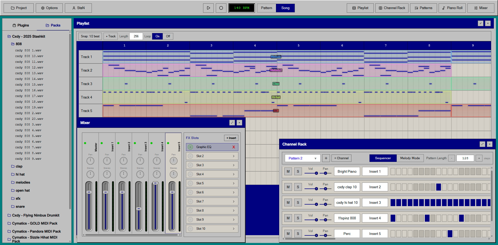
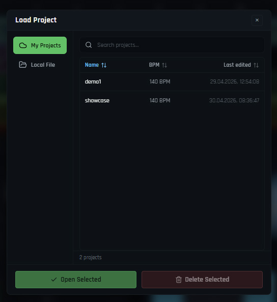

<div align="center">
  
  
  
  
  
  
  
  
</div>

# OpenStudio


OpenStudio is a browser and desktop DAW built with React, Web Audio API, and Electron. It brings the core beatmaking workflow into one app: browse sounds, build patterns, edit melodies, arrange clips, mix tracks, save projects locally or in the cloud, and export the final track to WAV or MP3.
<br><br>


## Table of Contents

- [Links](#links)
- [Why OpenStudio](#why-openstudio)
- [Highlights](#highlights)
- [Feature Overview](#feature-overview)
- [Themes](#themes)
- [Built-in Instruments](#built-in-instruments)
- [Screenshots](#screenshots)
- [Sample Projects](#sample-projects)
- [Getting Started](#getting-started)
- [Build and Packaging](#build-and-packaging)
- [Scripts](#scripts)
- [Project Structure](#project-structure)
- [Tech Stack](#tech-stack)
- [Sounds and MIDI Packs](#sounds-and-midi-packs)
- [License](#license)

## Links

- Web App: `https://openstudio-daw.vercel.app`
- Desktop Releases: `https://github.com/808StaN/OpenStudio/releases`
- Repository: `https://github.com/808StaN/OpenStudio`

## Why OpenStudio

OpenStudio was built as a practical beatmaking environment where the main DAW loop works end to end: choose sounds, write patterns, edit notes, arrange clips, mix tracks, save the project, and export the final audio.

It is a full interactive app rather than a static UI mockup, with multiple DAW windows, realtime audio playback, offline rendering, project persistence, drag-and-drop editing, cloud project storage, theming, and desktop packaging in one codebase.

## Highlights

- Channel Rack, Piano Roll, Playlist, Mixer, Browser, and FX Plugin windows
- Realtime sample playback, SoundFont instruments, mixer routing, meters, and built-in FX
- Local `.os` project files plus Supabase-backed cloud saves, loading, overwrites, search, sorting, and deletion
- Offline WAV / MP3 rendering through the same audio-domain timing logic used by playback
- Runtime DAW themes with separate plugin styling for consistent built-in effect UIs
- Electron desktop packaging from the same React/Web Audio codebase

## Feature Overview

### DAW Workspace

- Floating, resizable DAW windows with z-index management, maximize/restore, and persisted geometry
- Browser, Channel Rack, Piano Roll, Playlist, Mixer, Pattern List, Sample Settings, Render, and FX Plugin windows
- Context-aware window titles, keyboard shortcuts, and desktop-friendly interactions

### Browser and Packs

- Packs browser for WAV, audio samples, MIDI files, and generated pack manifests
- Plugin browser split into Instruments and Effects
- Drag samples, MIDI, instruments, and effects into the correct destination
- Sample preview from Packs before placing sounds in the project

### Channel Rack

- Step sequencer for drum-style pattern programming
- Melody preview mode for instrument channels
- Per-channel sample/plugin assignment
- Insert routing per channel
- Pattern length controls and pattern switching

### Piano Roll

- Note editing, selection, velocity lane, and preview playback
- MIDI import/drop support
- Scale highlighting and grid snapping
- Works with both sample-based channels and SoundFont instrument channels

### Playlist

- Arrangement timeline with patterns and audio clips
- Pattern drag from Pattern List to Playlist
- Audio clip drag from Packs to Playlist
- Clip move/resize workflows and visual drop previews
- Track grid, playhead, snap lines, waveform previews, and clip note previews

### Mixer

- Multiple mixer inserts with faders, pan, stereo separation, meters, and FX slots
- Per-slot enable/disable, selection, clearing, and drag/drop effect loading
- Built-in FX editor window with automatic content-fit sizing

### Built-in FX

- Graphic EQ with draggable response points and per-band controls
- Reverb with realtime knob editing and typed value input
- Maximizer / Limiter with graph and metering views
- Plugin UI styling is isolated from DAW themes so loaded plugins stay visually consistent

### Samples and Audio Editing

- Sample settings dialog with trim, envelope, pitch, normalize, and time-stretch controls
- Time-stretch modes for resample/stretch workflows
- Waveform preview and active-length visualization

### Export

- Offline project rendering using `OfflineAudioContext`
- WAV export
- MP3 export through `@breezystack/lamejs`
- Shared audio-domain helpers keep realtime playback and offline rendering aligned

### Accounts and Cloud Projects

- Supabase Auth account flow with username-based sign in and account creation
- User profiles store username, nickname, and email metadata
- Save projects locally as `.os` files, to the cloud, or to both destinations in one flow
- Cloud project overwrite protection when a project with the same name already exists
- Load project window with cloud project search, sortable columns, local file loading, and delete confirmation
- Cloud project files are stored in Supabase Storage while project metadata lives in a Supabase database table

## Themes

OpenStudio includes a runtime theme system built around CSS custom-property tokens. DAW themes override the application shell, windows, browser, playlist, mixer, and controls, while plugin styling is kept separate so loaded FX keep a consistent interface across themes.

Current DAW themes:

- `Default` - dark production theme
- `Teal Slate` - dark slate/teal theme
- `Studio 95` - classic desktop-inspired theme
- `Aero` - bright glassy theme

Theme files live in:

```text
src/styles/theme-main.css          base DAW tokens
src/styles/theme-plugins.css       plugin-only tokens
src/styles/themes/                 optional DAW theme overrides
```

### Studio 95 Theme



## Built-in Instruments

OpenStudio includes built-in SoundFont instrument plugins, including:

- Piano
- E-Piano
- Organ
- Nylon Guitar
- Strings
- Brass Section
- Flute
- and more

Instrument definitions are mapped in [`src/data/pluginInstruments.js`](src/data/pluginInstruments.js).

The instruments are loaded through [`soundfont-player`](https://github.com/danigb/soundfont-player), using General MIDI-style SoundFont names.

## Screenshots

### Main Workspace


### Piano Roll


### Mixer and FX


### Cloud and Local Project Loading



### Limiter Plugin


## Sample Projects

Example `.os` projects are included for quickly testing load behavior, instruments, patterns, and arrangements:

- [demo1.os](docs/projects/demo1.os)

## Getting Started

### Requirements

- Node.js 20+
- npm

### Clone

```bash
git clone https://github.com/808StaN/OpenStudio.git
cd OpenStudio
```

### Install

```bash
npm install
```

### Run Web App

```bash
npm run dev
```

### Run Desktop App in Development

```bash
npm run desktop:dev
```

## Build and Packaging

### Web Production Build

```bash
npm run build
```

### Desktop Unpacked Build

```bash
npm run desktop:pack
```

Output:

```text
release/win-unpacked/OpenStudio.exe
```

### Windows Installer

```bash
npm run desktop:installer
```

Installer artifacts are generated in `release/`.

## Scripts

- `npm run refresh:packs` - regenerate the Packs manifest from `public/packs`
- `npm run dev` - run the Vite web dev server
- `npm run build` - create a production web build
- `npm run preview` - preview the production build
- `npm run desktop:dev` - run Electron against the Vite dev server
- `npm run build:desktop` - build the app with desktop-relative asset paths
- `npm run desktop:pack` - build an unpacked Windows desktop app
- `npm run desktop:start` - build and launch the unpacked desktop app
- `npm run desktop:installer` - build the Windows installer
- `npm run lint` - run ESLint

## Project Structure

```text
OpenStudio/
|-- src/
|   |-- audio/             realtime scheduling, mixer graph, export/render pipeline
|   |   |-- core/          scheduler, mixer graph, playback nodes, voice helpers
|   |   `-- domain/        pure audio/domain helpers for samples, stretch, FX params
|   |-- components/        DAW windows, editors, Browser, Mixer, Playlist, Piano Roll
|   |   |-- browser/       Packs and plugin browser trees
|   |   |-- channel-rack/  Channel Rack rows, controls, step grid, piano preview
|   |   |-- fx-plugin/     Graphic EQ, Reverb, Maximizer, FX editor utilities
|   |   |-- mixer/         mixer tracks, FX slots, drag/drop handlers
|   |   `-- playlist/      arrangement grid, clips, drag/drop placement logic
|   |-- data/              built-in instrument/plugin metadata
|   |-- store/             Redux slice, reducers, initial state, persistence helpers
|   |-- styles/            app CSS, component CSS, base tokens, plugin tokens
|   |   `-- themes/        optional DAW theme override files
|   `-- utils/             MIDI, pattern, drag/session, and sample URL helpers
|-- electron/              Electron main process and preload bridge
|-- scripts/               pack manifest, Electron dev, installer asset scripts
|-- public/packs/          user/sample pack assets and generated manifest
`-- docs/                  screenshots, media, and sample projects
```

## Tech Stack

- JavaScript / ES modules - application codebase and tooling scripts
- HTML5 and CSS3 - app shell, custom UI, responsive layouts, and theme styling
- React 19 - windowed DAW interface, editors, dialogs, and plugin UIs
- Redux Toolkit + React Redux - project state, mixer state, transport state, patterns, clips, channels, and UI state
- Web Audio API - realtime playback, scheduling, routing, gain, pan, filters, meters, and FX processing
- `OfflineAudioContext` - offline project rendering/export path
- `soundfont-player` - built-in SoundFont instrument playback
- `@breezystack/lamejs` - MP3 encoding for rendered projects
- Supabase Auth - account creation, sign in, and authenticated user sessions
- PostgreSQL / Supabase Database - project metadata and user profile records
- Supabase Storage - cloud `.os` project file storage
- Vite 8 - dev server and production bundling
- Electron 41 - desktop runtime for the Windows app
- Electron Builder - unpacked desktop builds and NSIS installer packaging
- `react-rnd` - floating, draggable, resizable DAW windows
- `lucide-react` - application icons
- Vercel - hosted web deployment

## Sounds and MIDI Packs

OpenStudio includes free drumkits and MIDI packs collected for educational/demo use, so the app can be tested immediately without hunting for extra sounds.

Shoutout to producers and teams sharing free producer resources, including Cxdy, Rio Leyva, and Cymatics. Their public drumkits and MIDI packs make OpenStudio easier to demo, test, and learn from. If any included material needs different crediting or should be removed, please contact me through email: `dstanisz.dev@gmail.com`.

## License

Licensed under `GPL-3.0-only`. See [LICENSE](LICENSE).
